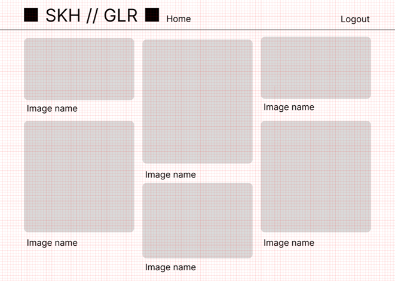

# Galerija

## 1. Sprendžiamo uždavinio aprašymas:

**Projekto tikslas** – sukurti galerijos valdymo sistemą, leidžiančią naudotojams saugoti, tvarkyti, dalintis vaizdus ir komentuoti.

**Sistemos paskirtis**:
Sistemos paskirtis – suteikti intuityvią ir patogią sąsają vartotojams, norintiems valdyti vaizdus. Naudotojai galės įkelti vaizdus, peržiūrėti ir komentuoti.

**Funkciniai reikalavimai:**
•	Vartotojų valdymas: registracija, prisijungimas, autentifikacija ir autorizacija naudojant JWT.
•	Vaizdų valdymas: vaizdų įkėlimas, redagavimas, šalinimas ir peržiūra.
•	Komentavimo sistema: galimybė komentuoti.

**Pasirinktų technologijų aprašymas:**
•	Backend: Node.js
•	Frontend: React.js
•	Duomenų bazė: PostgreSQL
•	Autentifikacija/Autorizacija: JWT
•	Debesų technologijos: Azure

## 2. Sistemos architektūra

UML deployment diagrama:


## 3. Naudotojo sąsajos projektas

### Login / Register langai ir wireframe:


---

---

### Home/galerijų peržiūros langas ir wireframe:


---

---

### Galerijos peržiūros langas ir wireframe:


---

---

### Image peržiūros langas ir wireframe:


---

---

### Galerijos sukūrimo / redagavimo langas ir wireframe:


---

---

### Image įkėlimo langas ir wireframe:


---

---

## 4. API specifikacija

[API specifikacija](api-docs.json)

### Authentication Endpoints

#### 1. Register a new user
**Endpoint**: `POST /api/auth/register`

**Possible Responses**:
- `201`: User registered successfully
- `400`: Username and password are required
- `409`: Username already exists
- `500`: Internal server error

**Example API Call**:
```json
POST /api/auth/register
{
  "username": "johndoe",
  "password": "password123",
  "role": "admin"
}
```

**Example Response**:
```json
201 Created
{
  "id": 1,
  "username": "johndoe",
  "role": "admin"
}
```

#### 2. Login a user
**Endpoint**: `POST /api/auth/login`

**Possible Responses**:
- `200`: Login successful, returns a JWT token
- `400`: Username and password are required
- `401`: Invalid credentials. Incorrect password
- `404`: Invalid credentials. User does not exist
- `500`: Internal server error

**Example API Call**:
```json
POST /api/auth/login
{
  "username": "johndoe",
  "password": "password123"
}
```

**Example Response**:
```json
200 OK
{
  "token": "eyJhbGciOiJIUzI1NiIsInR5cCI6IkpXVCJ9..."
}
```

### Comments Endpoints

#### 3. Create a new comment for a specific image
**Endpoint**: `POST /api/galleries/{galleryId}/images/{imageId}/comments`

**Possible Responses**:
- `201`: Comment created successfully
- `422`: Invalid content
- `500`: Internal server error

**Example API Call**:
```json
POST /api/galleries/1/images/1/comments
{
  "content": "This is a great image!"
}
```

**Example Response**:
```json
201 Created
{
  "id": 1,
  "image_id": 1,
  "user_id": 1,
  "content": "This is a great image!"
}
```

#### 4. Get all comments for a specific image
**Endpoint**: `GET /api/galleries/{galleryId}/images/{imageId}/comments`

**Possible Responses**:
- `200`: A list of comments for the image
- `500`: Internal server error

**Example API Call**:
```json
GET /api/galleries/1/images/1/comments
```

**Example Response**:
```json
200 OK
[
  {
    "id": 1,
    "image_id": 1,
    "user_id": 1,
    "username": "johndoe",
    "content": "This is a great image!"
  }
]
```

#### 5. Get a specific comment by ID
**Endpoint**: `GET /api/galleries/{galleryId}/images/{imageId}/comments/{commentId}`

**Possible Responses**:
- `200`: Comment found
- `404`: Comment not found
- `500`: Internal server error

**Example API Call**:
```json
GET /api/galleries/1/images/1/comments/1
```

**Example Response**:
```json
200 OK
{
  "id": 1,
  "image_id": 1,
  "user_id": 1,
  "username": "johndoe",
  "content": "This is a great image!"
}
```

#### 6. Update a specific comment
**Endpoint**: `PUT /api/galleries/{galleryId}/images/{imageId}/comments/{commentId}`

**Possible Responses**:
- `200`: Comment updated successfully
- `403`: Permission denied
- `404`: Comment not found
- `500`: Internal server error

**Example API Call**:
```json
PUT /api/galleries/1/images/1/comments/1
{
  "content": "Updated comment content."
}
```

**Example Response**:
```json
200 OK
{
  "id": 1,
  "image_id": 1,
  "user_id": 1,
  "content": "Updated comment content."
}
```

#### 7. Delete a specific comment
**Endpoint**: `DELETE /api/galleries/{galleryId}/images/{imageId}/comments/{commentId}`

**Possible Responses**:
- `200`: Comment deleted successfully
- `403`: Permission denied
- `404`: Comment not found
- `500`: Internal server error

**Example API Call**:
```json
DELETE /api/galleries/1/images/1/comments/1
```

**Example Response**:
```json
200 OK
{
  "message": "Comment deleted successfully"
}
```

### Galleries Endpoints

#### 8. Create a new gallery
**Endpoint**: `POST /api/galleries`

**Possible Responses**:
- `201`: Gallery created successfully
- `422`: Validation error
- `500`: Internal server error

**Example API Call**:
```json
POST /api/galleries
{
  "name": "My Gallery",
  "description": "A collection of my favorite images."
}
```

**Example Response**:
```json
201 Created
{
  "id": 1,
  "name": "My Gallery",
  "description": "A collection of my favorite images."
}
```

#### 9. Get all galleries
**Endpoint**: `GET /api/galleries`

**Possible Responses**:
- `200`: A list of galleries
- `500`: Internal server error

**Example API Call**:
```json
GET /api/galleries
```

**Example Response**:
```json
200 OK
[
  {
    "id": 1,
    "name": "My Gallery",
    "description": "A collection of my favorite images."
  }
]
```

#### 10. Get galleries for the currently authenticated user
**Endpoint**: `GET /api/galleries/me`

**Possible Responses**:
- `200`: A list of galleries for the authenticated user
- `404`: No galleries found for the user
- `500`: Internal server error

**Example API Call**:
```json
GET /api/galleries/me
```

**Example Response**:
```json
200 OK
[
  {
    "id": 1,
    "name": "My Gallery",
    "description": "A collection of my favorite images."
  }
]
```

#### 11. Get a specific gallery by ID
**Endpoint**: `GET /api/galleries/{galleryId}`

**Possible Responses**:
- `200`: Gallery found
- `404`: Gallery not found
- `500`: Internal server error

**Example API Call**:
```json
GET /api/galleries/1
```

**Example Response**:
```json
200 OK
{
  "id": 1,
  "name": "My Gallery",
  "description": "A collection of my favorite images."
}
```

#### 12. Update a specific gallery by ID
**Endpoint**: `PUT /api/galleries/{galleryId}`

**Possible Responses**:
- `200`: Gallery updated successfully
- `403`: Permission denied
- `404`: Gallery not found
- `500`: Internal server error

**Example API Call**:
```json
PUT /api/galleries/1
{
  "name": "Updated Gallery Name",
  "description": "Updated description for the gallery."
}
```

**Example Response**:
```json
200 OK
{
  "id": 1,
  "name": "Updated Gallery Name",
  "description": "Updated description for the gallery."
}
```

#### 13. Delete a specific gallery by ID
**Endpoint**: `DELETE /api/galleries/{galleryId}`

**Possible Responses**:
- `200`: Gallery deleted successfully
- `403`: Permission denied
- `404`: Gallery not found
- `500`: Internal server error

**Example API Call**:
```json
DELETE /api/galleries/1
```

**Example Response**:
```json
200 OK
{
  "message": "Gallery deleted successfully"
}
```

### Images Endpoints

#### 14. Create a new image in a specific gallery
**Endpoint**: `POST /api/galleries/{galleryId}/images`

**Possible Responses**:
- `201`: Image created successfully
- `422`: Validation error
- `500`: Internal server error

**Example API Call**:
```json
POST /api/galleries/1/images
{
  "image": "image_file",
  "title": "Beautiful Sunset"
}
```

**Example Response**:
```json
201 Created
{
  "id": 1,
  "url": "/uploads/image.jpg",
  "title": "Beautiful Sunset"
}
```

#### 15. Get all images for a specific gallery
**Endpoint**: `GET /api/galleries/{galleryId}/images`

**Possible Responses**:
- `200`: A list of images for the gallery
- `500`: Internal server error

**Example API Call**:
```json
GET /api/galleries/1/images
```

**Example Response**:
```json
200 OK
[
  {
    "id": 1,
    "url": "/uploads/image.jpg",
    "title": "Beautiful Sunset"
  }
]
```

#### 16. Get a specific image
**Endpoint**: `GET /api/galleries/{galleryId}/images/{imageId}`

**Possible Responses**:
- `200`: Image found
- `404`: Image not found
- `500`: Internal server error

**Example API Call**:
```json
GET /api/galleries/1/images/1
```

**Example Response**:
```json
200 OK
{
  "id": 1,
  "url": "/uploads/image.jpg",
  "title": "Beautiful Sunset"
}
```

#### 17. Update a specific image
**Endpoint**: `PUT /api/galleries/{galleryId}/images/{imageId}`

**Possible Responses**:
- `200`: Image updated successfully
- `404`: Image not found
- `500`: Internal server error

**Example API Call**:
```json
PUT /api/galleries/1/images/1
{
  "url": "/uploads/image_updated.jpg",
  "title": "Updated Title"
}
```

**Example Response**:
```json
200 OK
{
  "id": 1,
  "url": "/uploads/image_updated.jpg",
  "title": "Updated Title"
}
```

#### 18. Delete a specific image
**Endpoint**: `DELETE /api/galleries/{galleryId}/images/{imageId}`

**Possible Responses**:
- `200`: Image deleted successfully
- `404`: Image not found
- `500`: Internal server error

**Example API Call**:
```json
DELETE /api/galleries/1/images/1
```

**Example Response**:
```json
200 OK
{
  "message": "Image deleted successfully"
}
```

## 5. Išvados

- Funkciniai reikalavimai įgyvendinti: galerijų valdymas, vaizdų valdymas, komentavimo sistema.

- Naudotos technologijos pasirinktos tinkamai ir atitinka sistemos poreikius.

- Backend sistema sukurta naudojant Node.js, užtikrinant sklandų duomenų apdorojimą.

- Frontend sistema sukurta naudojant React.js, leidžianti lengvai valdyti vartotojo sąsają.

- Duomenų bazė PostgreSQL pasirinkta dėl savo efektyvumo ir patikimumo.

- Autentifikacija ir autorizacija įgyvendinta naudojant JWT technologiją, užtikrinant saugumą.

- Debesų paslaugos Azure užtikrino sistemos prieinamumą ir lankstumą.

- Sistemos architektūra užtikrina gerą našumą ir galimybę tobulinti ateityje.